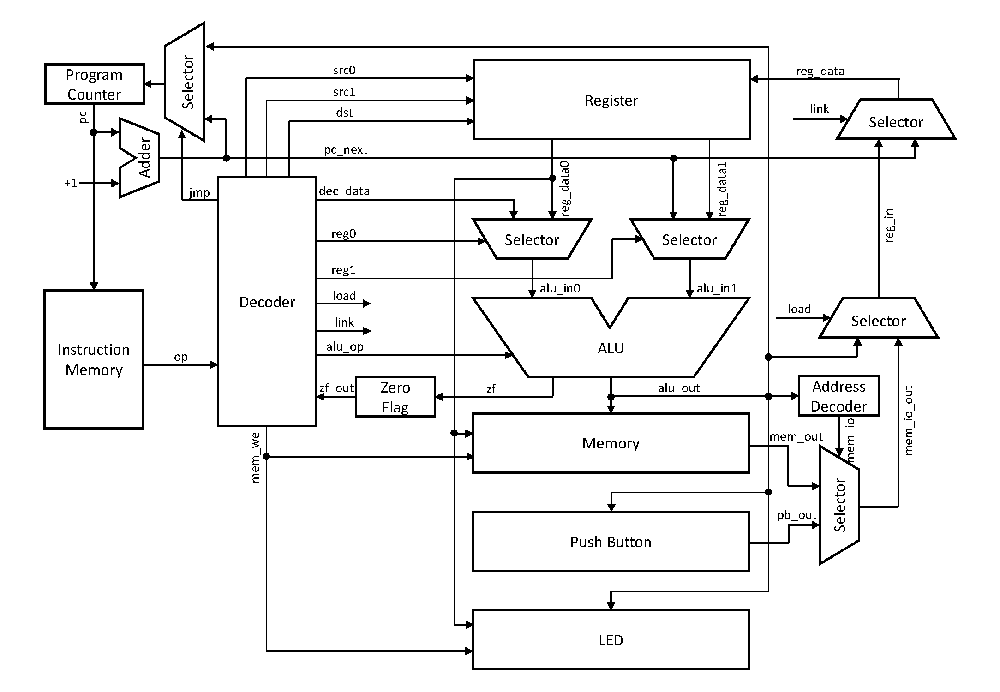

# CPU

Verilog code for CPU



## Instruction

Instruction format

| [15:12] | [11:8] | [7:4] | [3:0] | OP                |
|:-------:|:------:|:-----:|:-----:|:-----------------:|
| OP      | rs1    | rs0   | rd    | AND, OR, ADD, SUB |
| OP      | rs1    | rs0   | 0000  | CMP               |
| OP      | rs1    | imm          || ADDI, SUBI, CMPI  |
| OP      | rs1    | imm   | rd    | LOAD, JMPR        |
| OP      | rs1    | rs0   | imm   | STORE             |
| OP      | imm           || rd    | JMP, JNZ, LI      |

Control signals

| reg_we | mem_we | reg1 | reg0 | jmp | link | load | OP                |
|:------:|:------:|:----:|:----:|:---:|:----:|:----:|:-----------------:|
| 1      | 0      | 1    | 1    | 0   | 0    | 0    | AND, OR, ADD, SUB |
| 0      | 0      | 1    | 1    | 0   | 0    | 0    | CMP               |
| 1      | 0      | 1    | 0    | 0   | 0    | 0    | ADDI, SUBI        |
| 0      | 0      | 1    | 0    | 0   | 0    | 0    | CMPI              |
| 1      | 0      | 1    | 0    | 0   | 0    | 1    | LOAD              |
| 0      | 1      | 1    | 0    | 0   | 0    | 0    | STORE             |
| 1      | 0      | 0    | 0    | 1   | 1    | 0    | JMP, JMPR         |
| 1      | 0      | 0    | 0    | zf  | zf   | 0    | JNZ               |
| 1      | 0      | 1    | 0    | 0   | 0    | 0    | LI                |

### AND

```
format: ADD rs1 rs0 rd
code: rd = rs1 & rs0
      pc = pc + 1
```

### OR

```
format: OR rs1 rs0 rd
code: rd = rs1 | rs0
      pc = pc + 1
```

### ADD

```
format: ADD rs1 rs0 rd
code: rd = rs1 + rs0
      pc = pc + 1
```

### SUB

```
format: SUB rs1 rs0 rd
code: rd = rs1 - rs0
      pc = pc + 1
```

### CMP

```
format: CMP rs1 rs0
code: zf = (rs1 == rs0)? 1'b1 : 1'b0;
      pc = pc + 1
```

### ADDI

```
format: ADDI rs1 imm
code: rs1 = rs1 + imm
      pc = pc + 1
```

### SUBI

```
format: SUBI rs1 imm
code: rs1 = rs1 - imm
      pc = pc + 1
```

### CMPI

```
format: CMPI rs1 imm
code: zf = (rs1 == imm)? 1'b1 : 1'b0;
      pc = pc + 1
```

### LOAD

```
format: LOAD rs1 rd imm
code: rd = mem[rs1+imm]
      pc = pc + 1
```

### STORE

```
format: STORE rs1 rs0 imm
code: mem[rs1+imm] = rs0
      pc = pc + 1
```

### JMP

```
format: JMP rd imm
code: rd = pc + 1
      pc = imm
```

### JMPR

```
format: JMPR rs1 rd imm
code: rd = pc + 1
      pc = rs1 + imm
```

### JNZ

```
format: JNZ rd imm
code: rd = pc + 1
      pc = (zf)? imm : (pc + 1)
```

### LI

```
format: LI rd imm
code: rd = imm
      pc = pc + 1
```
